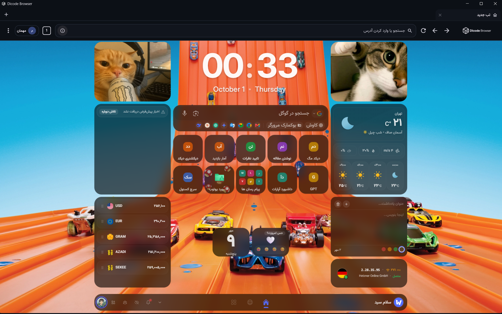
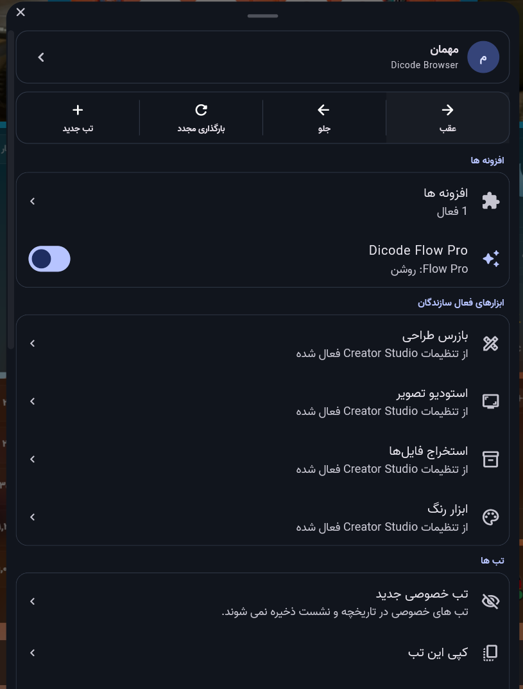
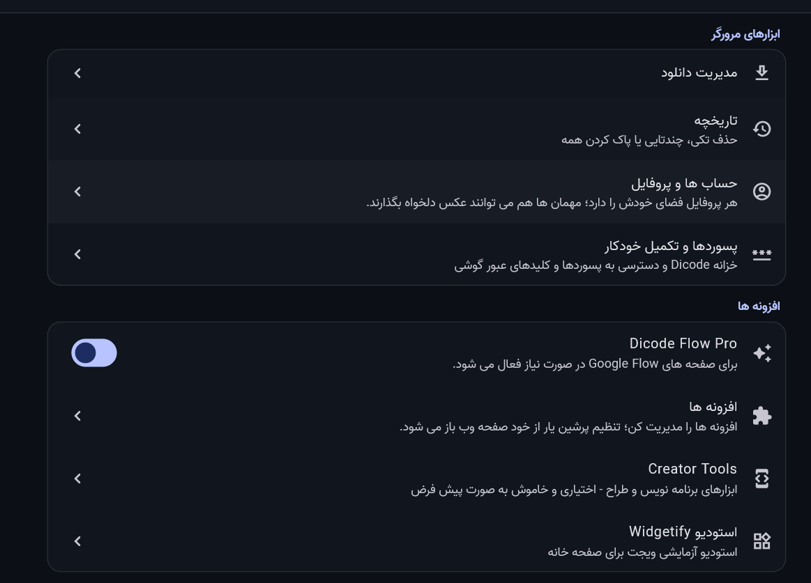

  

<h1 align="center">مرورگر دیکد | Dicode Browser</h1>

  مرورگری فارسی‌محور برای وب‌گردی روزانه؛ با نسخه‌های اندروید و دسکتاپ.

  <a href="https://mcodersir.github.io/DicodeBrowser/">صفحهٔ رسمی و دریافت‌ها</a>
  · <a href="https://github.com/mcodersir/DicodeBrowser/releases/tag/v1.0.2">فایل‌ها و یادداشت‌های انتشار ۱.۰.۲</a>

## تصاویر محیط برنامه

  
  &nbsp;&nbsp;
  

## دریافت نسخهٔ ۱.۰.۲

| سیستم‌عامل | دریافت |
| --- | --- |
| Windows 64-bit — نصب‌کننده | [DicodeBrowser-Setup-x64-v1.0.2.exe](https://github.com/mcodersir/DicodeBrowser/releases/download/v1.0.2/DicodeBrowser-Setup-x64-v1.0.2.exe) |
| Windows 64-bit — نسخهٔ ZIP بدون نصب | [DicodeBrowser-Windows-x64-v1.0.2.zip](https://github.com/mcodersir/DicodeBrowser/releases/download/v1.0.2/DicodeBrowser-Windows-x64-v1.0.2.zip) |
| Android — بیشتر گوشی‌ها (ARM64) | [APK برای ARM64](https://github.com/mcodersir/DicodeBrowser/releases/download/v1.0.2/DicodeBrowser-Android-arm64-v8a-v1.0.2.apk) |
| Android — ARM 32-bit | [APK برای armeabi-v7a](https://github.com/mcodersir/DicodeBrowser/releases/download/v1.0.2/DicodeBrowser-Android-armeabi-v7a-v1.0.2.apk) |
| Android — x86_64 | [APK برای x86_64](https://github.com/mcodersir/DicodeBrowser/releases/download/v1.0.2/DicodeBrowser-Android-x86_64-v1.0.2.apk) |
| Linux 64-bit | [بستهٔ tar.gz](https://github.com/mcodersir/DicodeBrowser/releases/download/v1.0.2/DicodeBrowser-Linux-x64-v1.0.2.tar.gz) |
| macOS — Apple Silicon | [بستهٔ arm64](https://github.com/mcodersir/DicodeBrowser/releases/download/v1.0.2/DicodeBrowser-macOS-arm64-v1.0.2.zip) |
| macOS — Intel | [بستهٔ x86_64](https://github.com/mcodersir/DicodeBrowser/releases/download/v1.0.2/DicodeBrowser-macOS-x86_64-v1.0.2.zip) |

برای بررسی سلامت فایل‌ها، [فهرست SHA-256](https://github.com/mcodersir/DicodeBrowser/releases/download/v1.0.2/SHA256SUMS-v1.0.2.txt) را هم دریافت کنید. بسته‌های macOS فعلاً امضای توسعه‌دهنده و notarization اپل ندارند.

### راهنمای انتخاب و نصب

- **Windows — پیشنهاد ما:** فایل Setup با پسوند EXE را بگیر و اجرا کن؛ نصب فقط برای حساب کاربری فعلی انجام می‌شود. برای نسخهٔ بدون نصب، ZIP را کامل استخراج کن و `dicode_browser.exe` را از پوشهٔ استخراج‌شده اجرا کن؛ فایل‌های DLL و پوشهٔ `data` را جابه‌جا یا حذف نکن.
- **Android:** ARM64 برای بیشتر گوشی‌های جدید است؛ `armeabi-v7a` برای گوشی‌های قدیمی ۳۲ بیتی و `x86_64` برای شبیه‌سازها و دستگاه‌های x86_64.
- **Linux:** بستهٔ `tar.gz` را استخراج کن و فایل `dicode_browser` را از داخل پوشه اجرا کن.
- **macOS:** برای پردازنده‌های سری M نسخهٔ Apple Silicon و برای مک‌های Intel نسخهٔ x86_64 را بگیر؛ در اجرای اول ممکن است macOS تأیید بخواهد.

## دربارهٔ این مخزن

این مخزن عمومی برای صفحهٔ رسمی، تصاویر، راهنمای دریافت و فایل‌های انتشار است. سورس برنامه در این مخزن قرار ندارد.
